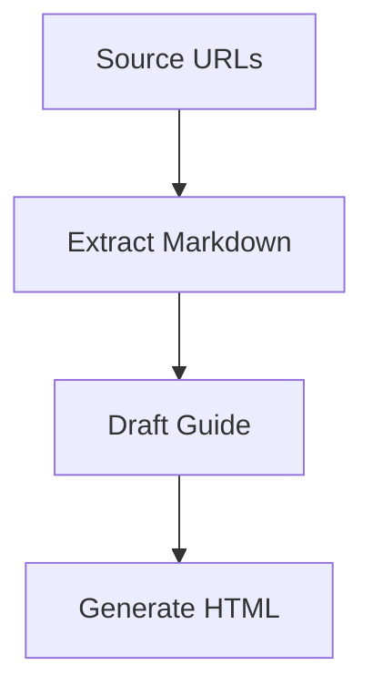

# GitHub Markdown Style Guide

This guide defines the Markdown conventions used when writing source Markdown for this repository.
It is based on GitHub Flavored Markdown (GFM), GitHub Docs writing syntax, and the repository-specific semantic blocks used by the build scripts.

Use this guide when writing or reviewing files under `content/`, especially `content/tag-guides/*.md`.

## Source References

- GitHub Docs: Basic writing and formatting syntax  
  https://docs.github.com/en/get-started/writing-on-github/getting-started-with-writing-and-formatting-on-github/basic-writing-and-formatting-syntax
- GitHub Docs: Working with advanced formatting  
  https://docs.github.com/en/get-started/writing-on-github/working-with-advanced-formatting
- GitHub Flavored Markdown Spec  
  https://github.github.com/gfm/

## Core Principles

- Prefer plain GitHub-compatible Markdown.
- Keep Markdown readable as source text, not only after rendering.
- Use semantic structure before visual styling.
- Use headings, paragraphs, lists, tables, quotes, and links for normal prose.
- Use fenced code blocks only for actual code, command examples, file contents, or repository-specific semantic blocks.
- Do not use generated HTML as source material.
- Do not edit files under `dist/` directly.

## Document Structure

Use one top-level heading per document.

```markdown
# Document Title

## Main Section

### Subsection
```

Rules:

- Start each source article with exactly one `#` heading.
- Do not skip heading levels. Use `##` after `#`, then `###` after `##`.
- Keep headings short and descriptive.
- Do not use headings only for visual emphasis.
- Prefer sentence-style headings over vague labels.

Good:

```markdown
## Why Tool Boundaries Matter
```

Avoid:

```markdown
## Important!!!
```

## Paragraphs

Use blank lines between paragraphs.

```markdown
This is the first paragraph.

This is the second paragraph.
```

Avoid manual line breaks inside normal prose unless they are intentional.
For most article text, a new paragraph is clearer than a forced line break.

## Emphasis

Use emphasis sparingly.

```markdown
Use **bold** for important terms or decisions.
Use _italic_ only when subtle emphasis is useful.
Use ~~strikethrough~~ for obsolete or corrected wording.
```

Rules:

- Prefer `**bold**` for important labels.
- Prefer `_italic_` for light emphasis.
- Do not overuse emphasis to compensate for unclear structure.
- Use headings, lists, or tables when the text needs structure.

## Blockquotes

Use blockquotes for quoted or quoted-like material.

```markdown
> This is a quoted passage or an explicitly quoted statement.
```

Rules:

- Use blockquotes for actual quotes, paraphrased quote callouts, or short quoted definitions.
- Do not use blockquotes as a generic note box.
- If the content is a repository-specific note, use normal prose or a semantic block instead.

## Lists

Use unordered lists for related items without sequence.

```markdown
- First item
- Second item
- Third item
```

Use ordered lists for steps or priority.

```markdown
1. Collect source URLs.
2. Save source pages.
3. Extract article content.
```

Rules:

- Keep list items parallel in grammar and level of detail.
- Use ordered lists only when order matters.
- Avoid deeply nested lists. If a list needs more than two levels, consider a table or a subsection.
- Leave a blank line before and after a list.

## Task Lists

Use task lists for checkable work items.

```markdown
- [ ] Add source URLs to `sources/articles.csv`.
- [ ] Run `npm run save:singlefile`.
- [x] Confirm that `dist/` is ignored by Git.
```

Rules:

- Use task lists for actionable checklist items.
- Do not use task lists for ordinary bullet points.
- Keep each item independently checkable.

## Links

Use inline links for normal references.

```markdown
[GitHub Flavored Markdown Spec](https://github.github.com/gfm/)
```

Use relative links for repository files.

```markdown
[Workflow README](../README.md)
[Domain glossary](../../content/domain-glossary.md)
```

Rules:

- Keep link text descriptive.
- Do not use raw URLs in prose unless the URL itself is important.
- Prefer relative links for files inside the repository.
- Keep link text on one line.
- In published pages under `dist/`, link to generated HTML, not source Markdown.

Good:

```markdown
See [the workflow README](../README.md).
```

Avoid:

```markdown
See https://github.com/AudioStakes/ai-agent-best-practices/...
```

## Section Links and Anchors

GitHub automatically creates anchors for headings. Link to headings with fragment links.

```markdown
[Go to Core Principles](#core-principles)
```

Rules:

- Prefer heading-based anchors.
- Keep headings stable if other files link to them.
- Avoid custom anchors unless a stable non-heading target is needed.

Custom anchors are allowed when necessary.

```html
<a id="stable-term-id"></a>
```

Repository-specific note:

- `content/domain-glossary.md` uses explicit anchors for glossary terms.
- Keep those anchors stable because generated pages and term links depend on them.

## Images

Use standard Markdown image syntax.

```markdown

```

Rules:

- Always include meaningful alt text.
- Use relative paths for repository-local images.
- Do not use images when text or tables are clearer.
- Avoid linking to private or temporary image URLs in source Markdown.

## Tables

Use tables for compact comparisons or structured metadata.

```markdown
| Field | Meaning |
|---|---|
| Source | Original article provider |
| URL | Original article URL |
| Tags | Related guide categories |
```

Rules:

- Keep tables small and readable in source form.
- Use tables for structured comparisons, not long prose.
- Align columns loosely; exact spacing is not required.
- Avoid very wide tables. Use subsections when content becomes too long.

## Inline Code

Use inline code for commands, file paths, package names, function names, and literal values.

```markdown
Run `npm run build` before `./serve.sh`.
Source Markdown lives under `content/`.
```

Rules:

- Use inline code for literal text the reader may type or inspect.
- Do not use inline code for ordinary emphasis.
- Do not wrap general concepts in backticks unless they refer to exact identifiers.

## Fenced Code Blocks

Use fenced code blocks for actual code, commands, file contents, or examples where exact formatting matters.

````markdown
```bash
npm run build
npm run verify
```
````

Use a language identifier when possible.

Common identifiers:

- `bash`
- `json`
- `yaml`
- `html`
- `css`
- `js`
- `markdown`
- `text`

Rules:

- Use code fences for code or exact literals only.
- Do not use code fences for normal prose.
- Do not use code fences just to create a visual box.
- Use repository-specific semantic fences only when the block is meant to be transformed by the site build.

## What Not to Put in Code Blocks

Do not use fenced code blocks for:

- Notes
- Warnings
- Definitions
- Ordinary paragraphs
- Plain bullet lists
- Checklists that should render as Markdown task lists
- Process steps that should render as ordered lists
- Key takeaways that should be normal prose
- Tables or comparison data that should be Markdown tables

Use normal Markdown instead.

Bad:

````markdown
```text
Important:
Use evaluation before deployment.
```
````

Better:

```markdown
**Important:** Use evaluation before deployment.
```

Bad:

````markdown
```text
- Define the task
- Choose the tools
- Evaluate the result
```
````

Better:

```markdown
1. Define the task.
2. Choose the tools.
3. Evaluate the result.
```

## Repository-Specific Semantic Fences

This repository supports semantic fences for tag-guide content. These are still fenced blocks, but they are not ordinary code blocks. The build scripts transform them into semantic HTML blocks.

Use them only in `content/tag-guides/*.md` when the rendered meaning is intentional.

Examples:

````markdown
```tone-good.takeaway
Start with the smallest agent design that can complete the task reliably.
```
````

````markdown
```tone-good.checklist
- The agent has a clear goal.
- The tool boundary is explicit.
- The failure mode is testable.
```
````

````markdown
```tone-neutral.process
1. Collect source material.
2. Extract article content.
3. Synthesize shared practices.
4. Draft the guide Markdown.
```
````

Common semantic suffixes:

| Suffix | Use for |
|---|---|
| `.takeaway` | One concise key point |
| `.checklist` | Practical checklist items |
| `.question-checklist` | Review questions |
| `.process` | Ordered workflow or sequence |
| `.risk` | Risk list |
| `.risk-ladder` | Low / medium / high risk levels |
| `.definition` | Structured definition content |
| `.guideline` | Practical guidance list |
| `.code-example` | Actual code or file examples |
| `.structured` | Label-and-detail structured items |

Rules:

- Use semantic fences intentionally, not as decoration.
- Prefer normal Markdown unless the semantic rendering adds value.
- Run `npm run check:tag-guides` to verify semantic fences.
- Run `npm run fix:tag-guides` only when you intentionally want to normalize source Markdown.
- `npm run build` and `npm run verify` must not modify source Markdown.

## Alerts

GitHub supports Markdown alerts such as notes, tips, warnings, and cautions.

```markdown
> [!NOTE]
> Useful information that readers should know.

> [!WARNING]
> Important risk information.
```

Repository rule:

- Use alerts sparingly.
- Prefer normal prose or semantic fences in tag guides when the build output should have repository-specific styling.
- Do not mix alerts and semantic fences for the same content.

## Collapsed Sections

GitHub supports collapsible sections with HTML `details` and `summary`.

```html
<details>
<summary>More details</summary>

Additional content goes here.

</details>
```

Rules:

- Use collapsed sections only for secondary information.
- Do not hide content that is necessary for understanding the article.
- Avoid collapsed sections in published guide articles unless there is a strong reason.

## Footnotes

Use footnotes sparingly for side comments or citations that would interrupt the flow.

```markdown
This practice depends on the deployment context.[^context]

[^context]: For example, internal tools and public-facing agents may need different approval gates.
```

Rules:

- Prefer inline links for ordinary references.
- Use footnotes only when they improve readability.
- Do not use footnotes as a substitute for source lists or references.

## Diagrams

GitHub supports Mermaid diagrams in Markdown.

````markdown

````

Repository rule:

- Use diagrams only when they clarify a workflow better than text.
- Keep diagrams small.
- Do not depend on diagrams as the only explanation.

## Mathematical Expressions

GitHub supports mathematical expressions in some contexts.

```markdown
Inline math: $x + y = z$

Block math:

$$
x + y = z
$$
```

Repository rule:

- Avoid math unless the article genuinely requires it.
- AI-agent best-practice guides should usually use prose, tables, and checklists instead.

## HTML in Markdown

GitHub allows some raw HTML in Markdown.

```html
<a id="custom-anchor"></a>
```

Rules:

- Use raw HTML only when Markdown cannot express the needed structure.
- Keep HTML minimal.
- Do not use HTML for ordinary emphasis, lists, or tables.
- Avoid inline styles in source Markdown unless there is a clear repository-specific reason.

Repository-specific exception:

- `content/index.md` may contain limited HTML when the page shell needs specific classes or layout hooks.
- Tag-guide articles should prefer plain Markdown and semantic fences.

## Escaping Markdown Characters

Use a backslash to show Markdown syntax literally.

```markdown
\*This is not italic.\*
\# This is not a heading.
```

Rules:

- Escape characters only when needed.
- Prefer fenced examples when showing multiple Markdown lines.

## Comments

Use HTML comments for editor notes that should not render.

```html
<!-- TODO: Confirm this claim against the source note before publishing. -->
```

Rules:

- Remove temporary comments before publishing unless they are intentionally useful to maintainers.
- Do not hide important reader-facing content in comments.

## Line Breaks

Use blank lines between paragraphs.

Avoid hard line breaks in normal prose.

If a hard line break is required, use one of these forms intentionally:

```markdown
First line  
Second line
```

```markdown
First line\
Second line
```

Repository rule:

- Prefer separate paragraphs over hard line breaks.
- Use hard line breaks only for compact metadata or poetry-like formatting.

## Article Source Format

Published guide source files under `content/tag-guides/` should generally follow this structure.

```markdown
# 01. Topic Name

## この章で見直せること

```tone-good.checklist
- Review item one.
- Review item two.
```

## 一言で言うと

```tone-good.takeaway
The main point of this guide.
```

## Why This Matters

## Best Practices

## Common Failure Modes

## Practical Checklist

## Source Coverage

## References
```

Rules:

- Keep the first heading aligned with the file number and guide title.
- Include a practical review section near the top.
- Make claims traceable to source notes or references.
- Do not invent recommendations that are not supported by source material.
- Keep repository terminology aligned with `content/domain-glossary.md`.

## Source Fidelity

When converting source articles into guide Markdown:

- Separate source facts from editorial synthesis.
- Keep claims grounded in source notes.
- Mark uncertainty when sources disagree or support is weak.
- Do not turn one vendor-specific recommendation into a universal rule unless multiple sources support it.
- Prefer durable best practices over short-lived product details.

## Formatting Checklist

Before committing Markdown, check the following:

- [ ] The file has exactly one top-level `#` heading.
- [ ] Heading levels do not skip.
- [ ] Paragraphs are separated by blank lines.
- [ ] Lists use proper Markdown list syntax.
- [ ] Tables are small and readable in source form.
- [ ] Links are descriptive and valid.
- [ ] Local repository links are relative.
- [ ] Code fences are used only for code, exact examples, or semantic blocks.
- [ ] Semantic fences are intentional and normalized.
- [ ] Terminology matches `content/domain-glossary.md`.
- [ ] The Markdown is readable before rendering.

## Command Checklist

Use these commands when editing guide Markdown.

```bash
npm run check:tag-guides
npm run build
npm run verify:pages
npm run verify
```

If semantic fences need normalization:

```bash
npm run fix:tag-guides
```

Do not run `fix:tag-guides` casually. It intentionally updates source Markdown.
